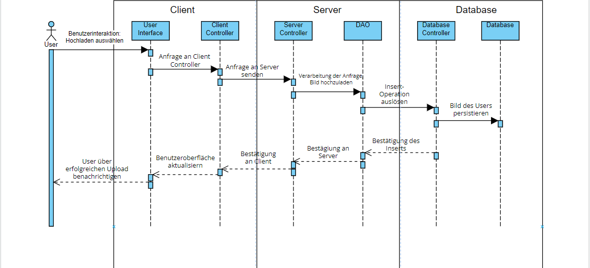

# Introduction and Goals

Alle relevanten Anforderungen, die Softwarearchitekten und Entwickler brücksichtigen sollen.

## Requirements Overview

**Main Features**

1. Die App soll 24/7 laufen und verwendbar sein.  
2. Nutzer sollen sich registrieren können.  
3. Nutzer sollen sich einloggen können.  
4. Nutzer sollen Bilder mit Beschreibungen hochladen können.  
5. Nutzer sollen Bilder kommentieren und liken können.  

## Quality Goals

**1.** Benutzerfreundlichkeit 
Motivation: Für Benutzer einfach zu bedienen, für eine positive Benutzererfahrung 

**2.** Leistung 
Motivation: Die App soll schnell laufen und nicht lange laden, flüssig Bilder hochladen 

**3.** Datenschutz 
Motivation: Die Sicherheit und Privatsphäre der Benutzer erhalten, da persönliche Bilder geteilt werden

## Stakeholders

**Form**

Table with role names, person names, and their expectations with respect
to the architecture and its documentation.

| Role/Name   | Contact        | Expectations       |
|-------------|----------------|--------------------|
| *Benutzer* | *\<User>* | *Individuen die in der App Bilder hochladen, kommentieren und liken.* |
| *Administrator* | *\<Admin>* | *Verwalten das Projekt und haben Zugang zu administrativen Funktionen* |
| *Software-Entwickler Team* | *\<Entwickler>* | *Das Team, das die App entwickelt und aufrechterhält.* |
| *Business Stakeholder* | *\<Stakeholder>* | *Unternehmensleiter, Manager die in den Erfolg der App investieren* |
| *Support Teams* | *\<Support>* | *Anfragen und Probleme von Kunden lösen* |

# Architecture Constraints

- Microservices Architektur:
  Skalierbare und flexible Architektur, je nach Nutzernzahl und Beliebtheit erweiterbar
- Implementierung in Java und Swift:
  Damit Software auf iOS und Android Geräte zugeschnitten ist
- Lizenzierung von Drittanbieter Software:
  Integrierung der Pixlr-Bildbearbeitung in die App
- Datenschutz:
  App speichert sensible Daten, die von Dritten nur beschränkt sichtbar sein sollen, Profile können privat sein (nur von Freunden sichtbar)
- Datenverschlüsselung:
  Sensible Daten zwischen den Kommunikationsschnittstellen gehören verschlüsselt, HTTPS-Verschlüsselung für die Kommunikation zwischen der mobilen App und dem Server

**Was sind Constraints**

Constraints sind Anforderungen, die Softwarearchitekten in ihrer Gestaltungsfreiheit sowie bei Entscheidungen zur Implementierung und Entwicklungsmethodik beschränken.

# System Scope and Context

**Inhalt**

Systemumfang und Kontext grenzen das System von seinen 
Kommunikationspartnern (benachbarte Systeme und Benutzer, = Kontext des Systems) ab. 
Sie spezifizieren dabei die externen Schnittstellen.

Wenn nötig, unterscheidet man den Geschäftskontext (domänenspezifische Eingaben und Ausgaben) 
vom technischen Kontext (Kanäle, Protokolle, Hardware).

## Business Context

**Was stellt es dar?**

Alle Daten, die mit dem System ausgetauscht werden

- Benutzer (Zielgruppe 18-35 Jahre alt) verwenden und interagieren mit der App, um Bilder hochzuladen oder anzusehen
- Über den App Store wird die App heruntergeladen und installiert
- Pixlr wird in die App zur Bildbearbeitung integriert
- Transaktionen, Datenschutz, Abonnements

## Technical Context

**Was stellt es dar?**

Das System und seine Umgebung, mit der es über technische Schnittstellen verbunden ist.

-   App selbst mit User Interface, Verarbeitung der hochgeladenen Bilder, Zahlung für das Abonnement
-   Benötigt Backend Services um mit dem Server zu verbinden und Datenbank zu verwenden
-   Auch verbunden mit externen Services, wie der Pixlr Bildbearbeitung, die integriert ist in der App

# Solution Strategy

**Contents**

-   Skalierbarkeit: Es wird eine Notwendigkeit geben, große Nutzerzahlen zu bewältigen. Durch Microservices können einzelne Komponenten der Anwendung unabhängig voneinander skaliert werden. 

-   Kontinuierliche Bereitstellung und Auslieferung: Wenn eine neue Funktion im Community-Bereich der Anwendung hinzugefügt wird, kann sie bereitgestellt werden, ohne die gesamte Anwendung erneut bereitstellen zu müssen.

-   Widerstandsfähigkeit: Wenn ein Dienst ausfällt, bedeutet das nicht zwangsläufig, dass die gesamte Anwendung abstürzt.

# Building Block View

**Content**

The building block view shows the static decomposition of the system
into building blocks (modules, components, subsystems, classes,
interfaces, packages, libraries, frameworks, layers, partitions, tiers,
functions, macros, operations, data structures, …) as well as their
dependencies (relationships, associations, …)

This view is mandatory for every architecture documentation. In analogy
to a house this is the *floor plan*.

**Motivation**

Maintain an overview of your source code by making its structure
understandable through abstraction.

This allows you to communicate with your stakeholder on an abstract
level without disclosing implementation details.

**Form**

The building block view is a hierarchical collection of black boxes and
white boxes (see figure below) and their descriptions.

**Level 1** is the white box description of the overall system together
with black box descriptions of all contained building blocks.

**Level 2** zooms into some building blocks of level 1. Thus it contains
the white box description of selected building blocks of level 1,
together with black box descriptions of their internal building blocks.

**Level 3** zooms into selected building blocks of level 2, and so on.

## Whitebox Overall System

Here you describe the decomposition of the overall system using the
following white box template. It contains

-   an overview diagram

-   a motivation for the decomposition

-   black box descriptions of the contained building blocks. For these
    we offer you alternatives:

    -   use *one* table for a short and pragmatic overview of all
        contained building blocks and their interfaces

    -   use a list of black box descriptions of the building blocks
        according to the black box template (see below). Depending on
        your choice of tool this list could be sub-chapters (in text
        files), sub-pages (in a Wiki) or nested elements (in a modeling
        tool).

-   (optional:) important interfaces, that are not explained in the
    black box templates of a building block, but are very important for
    understanding the white box. Since there are so many ways to specify
    interfaces why do not provide a specific template for them. In the
    worst case you have to specify and describe syntax, semantics,
    protocols, error handling, restrictions, versions, qualities,
    necessary compatibilities and many things more. In the best case you
    will get away with examples or simple signatures.

## Level 1

</img>

Motivation  
Auf Level 1 liegt der Grundbau, der bewusst schlicht und einfach gestaltet ist. Ein Benutzer nutzt die Image Sharing App, die wiederum Teile von Drittanbietern verwendet und eine Verbindung zum Internet herstellt.

Eingebundene Bausteine
| **Name**         | **Zuständigkeit** |
|------------------|--------------------|
| *Image Sharing App* |  *Die App mit all den dazugehörigen Funktionen*         |
| *Drittanbieter Applikationen* |  *Fremde Applikationen die beispielsweise Filter bereit stellen*         |

Relevante Schnittstellen
Ein bedeutender Aspekt ist die Integration von Drittanbietern, da die App möglicherweise mit mehreren von ihnen interagieren kann. Dies sollte bei der Umsetzung berücksichtigt werden.

## Level 2

</img>

Motivation  
Fortgeschrittener ist Level 2, da er detailliertere Funktionen der App und des Benutzers aufzeigt. Hier werden die drei Hauptaufgaben der App und ihre gegenseitige Verbindung deutlich.

Eingebundene Bausteine
| **Name**         | **Zuständigkeit** |
|------------------|--------------------|
| *Authentification* |  *Authentisierung von Users mittels Login/Registrierung*         |
| *Interaction with Other Users* |  *Likes, Kommentare etc.*         |
| *Upload Image* |  *Nötigen Funktionen für das hochladen von Bildern*         |

Relevante Schnittstellen  
Es ist wichtig zu betonen, dass es Administratoren gibt, die spezielle Rechte besitzen, um die App zu verwalten.

## Level 3

</img>

Motivation  
Level 3 stellt eine präzise Vorlage für die technische Umsetzung der Anwendung dar. Sie fungiert als Leitfaden für das Projektteam, um die theoretischen Konzepte in die Praxis umzusetzen.

Eingebundene Bausteine  
| **Name**         | **Zuständigkeit** |
|------------------|--------------------|
| *Register* |  *Registriert den Benutzer, damit er sich anmelden kann*         |
| *Login* |  *Nachdem sich der User registriert hat kann er sich jederzeit anmelden und somit auf die anderen Funktionen zugreifen*         |
| *Gallery* |  *In der Galerie besteht die Möglichkeit, auf bereits gespeicherte Fotos zuzugreifen, indem die Funktionen diese aus der Datenbank abrufen*         |
| *Picture* |  *Enthält Features zur Bearbeitung oder Anpassung von Bildern.*         |
| *Social_Interaction* |  *Beinhaltet Funktionen zur Interaktionen mit anderen Benutzern*         |
| *Upload* |  *Lädt die ausgewählten Bilder auf das Profil*         |
| *Notification* |  *Benachrichtigt den Nutzer darüber, dass es Interaktionen mit seinem Profil gegeben hat.*         |

Relevante Schnittstellen 
Signifikante Klassen sind "Notification" und "Login", da sie bestimmte Entwurfsmuster nachbilden sollen. Die "Notification"-Klasse soll als Beobachter fungieren und den Benutzer benachrichtigen, wenn es Interaktionen mit seinem Profil gibt, während die "Login"-Klasse als Singleton implementiert werden soll, um sicherzustellen, dass kein Benutzer zwei Sitzungen gleichzeitig starten kann.

**Inhalt**

Verhalten und Interaktionen der Blöcke des Systems

## Szenario: Benutzer lädt Bild hoch 

</img>

-   Ein Bild wird hochgeladen, indem der eingeloggte Nutzer auf dem
Interface den Button zum Hochladen tippt. Dann wird vom Client eine Anfrage an den
Server geschickt, der dann eine Datenbankabfrage auslöst. Dann wird eine Bestätigung über den Upload weitergereicht.

## Szenario: Benutzer registriert einen Account

</img>

-   Ein Nutzer muss sich registrieren. Dabei werden eingegebene Daten vom Client
entgegengenommen und an den Server gesendet, wo diese validiert werden. Falls die Daten nicht gültig sind, sendet der Server einen Fehler an den Client, was der Nutzer auf seinem Interface sieht. Ansonsten werden die Daten in der Datenbank gespeichert und eine Bestätigung über die erfolgreiche Registrierung zurückgeschickt.

# Deployment View

**Inhalt**

Wie die Software-Teile des Systems auf der Hardware verteilt sind und
wie sie miteinander interagieren, um die App in Betrieb zu setzen.

**CAP-Theorem**

Die App erfüllt die Partitionstoleranz und Verfügbarkeit, da selbst bei Unterbrechungen die App weiterläuft und immer für Benutzeranfragen verfügbar ist, selbst bei Fehlern des Servers.  
Dabei kann die Konsistenz nicht immer erfüllt sein, da nicht garantiert ist, dass alle Nutzer immer die neuesten Daten sehen.

## Diagramm

</img>
Das Deployment enthält ein Smartphone, was über eine Mobile App mit Integration der Bildbearbeitungssoftware "Pixlr" zum Server und Backup Server verbunden ist. Diese beiden sind mit der Datenbank verbunden, und halten so das gesamte System aufrecht.

# Cross-cutting Concepts

**Inhalt**

Lösungen und Regulierungen die in mehreren Teilen des Systems wichtig sind, also zu verschiedenen Blöcken gehören.

## *Development Concept*

- Agiles Development:  
Verwendung agiler Entwicklungsmethoden, um auf Änderungen der Anforderungen flexibel reagieren zu können.
- Versionierung:  
Die Anwendung von Instrumenten, die die Versionierung erleichtern, ermöglicht die effiziente Verwaltung und präzise Rückverfolgung von Softwareänderungen.
## *Architecture and Design Patterns*

- Microservice Architektur:  
Anwendung unabhängiger Mikrodienste, damit das Projekt skalierbar und flexibel bleibt.
Da die Firma international vertreten ist, hat sie genug Ressourcen, um mit Mikrodiensten zu entwickeln.
- Singleton Pattern:  
Der Singleton gewährleistet, dass eine Klasse exakt eine Instanz besitzt und fungiert somit als universeller Einstiegspunkt für jeden Benutzer. 
Zum Beispiel: Ein Benutzer meldet sich auf sein Profil an.
- Observer Pattern:  
Das Pattern ermöglicht es einem Objekt, Änderungen mit seinen Abhängigkeiten zu teilen.
Zum Beispiel erhält ein Benutzer eine Benachrichtigung, wenn sein Bild geliked oder kommentiert wird.
## *Safety and Security Concepts*

- Authentifizierung und Authorisation:  
Registrierte Benutzer können sich über ihre Benutzerdaten in ihren Account einloggen.

- Automatische regelmäßige Sicherungen:  
Die App sichert automatisch regelmäßig alle Benutzerdaten, hochgeladenen Bilder und relevanten Metadaten, um Datenverlust zu verhindern.

## *User Experience Concepts*

- Intuitive Navigation:  
Die App soll intuitiv und einfach bedienbar sein, damit neue Benutzer
auch bei unserer App bleiben und nicht frustriert sind.

# Architecture Decisions

- Bildspeicherung und -lieferung  
Alternative: Bilder in einem Cloud-basierten Speicherdienst (AWS, Google cloud..) lagern 
Entscheidung: Bilder in einer Datenbank speichern (Daten selbst managen)  

- Integration Software Drittanbieter (Pixlr) 
Alternative: Eigene Bildbearbeitungssoftware entwickeln 
Entscheidung: Integration in die Pixlr-API, damit Benutzer die Anwendung nicht verlassen zur Bildbearbeitung 

- Umsetzung des Abonnementmodells 
Alternative: Umsetzung eines Abonnementmodells von Drittanbietern 
Entscheidung: Eigenes benutzerdefiniertes Abonnementmodell entwickeln 

# Quality Requirements

**Inhalt**

Alle Qualitätsanforderungen mit einem Baum und Szenarien.

## Quality Tree

**Inhalt**

Klare und messbare Qualitätsziele, um die gewünschten Eigenschaften des Systems zu definieren.
Mit dem Baum werden diese übersichtlich visualisiert.
</img>

## Quality Scenarios

**Inhalt**

Qualitätsanforderungen konkretisiert:  
Was mit dem System passiert, wenn ein Reiz im System ankommt. Geordnet nach Priorität (oben ist das wichtigste). 

- Datenschutz:   Der Teamleiter will den Schutz der User gewährleisten, da es sonst zu rechtlichen Problemen kommen könnte. Dies geschieht mittels implementierung der dazu passenden Liabraries und Funktionen bis zum Ende des Projektes.

- Benutzerfreundlichkeit:   Ein User will das beim öffnen der App direkt alle wichtigen Features sehen und benutzen können.

- Fehlerbehandlung:   Ein Bildupload schlägt aufgrund von Netzwerkausfällen fehl. Die App sollte dem Benutzer eine klare und verständliche Fehlermeldung anzeigen und den Uploadprozess fortsetzen, wenn die Verbindung wiederhergestellt ist.

- Leistung:   Ein Benutzer öffnet die App. Die App soll alle neuen Bilder und Daten nach einer so kurzen Ladezeit wie möglich anzeigen.

- Skalierbarkeit:   Die Nutzerzahl steigt plötzlich um das Zehnfache an. Die App sollte in der Lage sein, diese zusätzlichen Nutzeranforderungen zu bewältigen, ohne die Leistung oder Antwortzeiten erheblich zu beeinträchtigen.

# Risks and Technical Debts
- Datenkonsistenz: Daten sind auf verschiedene Dienste verteilt, weshalb die Sicherstellung von Datenkonsistenz eine Herausforderung darstellen kann.
- Netzwerklatenz: Dienste müssen über ein Netzwerk kommunizieren, was zu geringfügigen Verzögerungen führen kann und sich auf die Leistung der Anwendung auswirken kann.
- Komplexität: Die Verwaltung mehrerer Dienste ist komplex: Überwachung, Protokollierung und Benachrichtigungssysteme sind erforderlich, um einen reibungslosen Betrieb sicherzustellen.

# Glossary

| Term        | Definition        |
|-------------|-------------------|
| *Microservices Architektur* | *Ein architektonisches Design, bei dem eine Anwendung in unabhängige, lose gekoppelte Dienste aufgeteilt wird, die eigenständig entwickelt, bereitgestellt und skaliert werden können.* |
| *Singleton Pattern* | *Ein Entwurfsmuster, das sicherstellt, dass eine Klasse nur eine Instanz besitzt und einen globalen Zugangspunkt für diese Instanz bietet.* |
| *Observer Pattern* | *Ein Entwurfsmuster, das es einem Objekt ermöglicht, Änderungen an seinen Abhängigkeiten zu teilen, indem es diesen erlaubt, sich als Beobachter zu registrieren und automatisch aktualisiert zu werden.* |
| *Authentifizierung und Authorisation* | *Prozesse zur Identifikation von Benutzern (Authentifizierung) und zur Festlegung von Zugriffsrechten basierend auf den Identitätsinformationen (Authorisation).* |
| *Cloud-basierte Speicherung* | *Speicherung von Daten, in diesem Fall Bilder, in einem externen Cloud-Dienst wie AWS oder Google Cloud, anstatt lokal in einer Datenbank.* |
| *Abonnementmodell* | *Ein Geschäftsmodell, bei dem Benutzer regelmäßige Zahlungen leisten, um auf bestimmte Funktionen oder Dienste zuzugreifen.* |
| *Qualitätsanforderungen* | *Spezifische Anforderungen an die Leistung, Sicherheit, Benutzerfreundlichkeit und andere Aspekte des Systems, um bestimmte Qualitätsziele zu erreichen.* |
| *Datenschutz* | *Maßnahmen und Regulierungen, die sicherstellen, dass die persönlichen Daten der Benutzer geschützt und sicher behandelt werden.* |
| *Netzwerklatenz* | *Die Verzögerung oder Latenzzeit bei der Übertragung von Daten über ein Netzwerk.* |
| *Datenkonsistenz* | *Die Gewährleistung, dass Daten in einem verteilten System konsistent sind und keine Inkonsistenzen zwischen verschiedenen Diensten auftreten.* |
| *Skalierbarkeit* | *Die Fähigkeit eines Systems, mit wachsender Nutzerzahl oder Anforderungen umzugehen, ohne dass die Leistung beeinträchtigt wird.* |
| *Technische Schulden* | *Eine metaphorische Beschreibung für die zusätzliche Arbeit, die in der Zukunft erforderlich ist, um Probleme oder Kompromisse in der aktuellen Entwicklung zu beheben.* |
| *Continuous Deployment (CD)* | *Ein Ansatz in der Softwareentwicklung, bei dem Änderungen automatisch und kontinuierlich in die Produktionsumgebung übernommen werden, um eine schnelle und effiziente Bereitstellung zu ermöglichen.* |
| *Cross-cutting Concerns* | *Aspekte einer Softwareanwendung, die nicht auf einen bestimmten Modul oder eine Funktion beschränkt sind, sondern verschiedene Teile des Systems betreffen, wie z.B. Sicherheit, Protokollierung und Authentifizierung.* |
| *CAP-Theorem* | *Ein theoretisches Konzept, das besagt, dass es in einem verteilten System nicht gleichzeitig möglich ist, Konsistenz, Verfügbarkeit und Partitionstoleranz vollständig zu gewährleisten. Bei einer Netzwerkpartition müssen Kompromisse eingegangen werden.* |
| *Backend Services* | *Die serverseitigen Dienste und Funktionen, die für die Verarbeitung von Anfragen, Datenbankzugriffe und andere serverseitige Aufgaben in einer Anwendung verantwortlich sind.* |
| *Mobile App Interface* | *Die Benutzerschnittstelle oder das Nutzererlebnis, das auf einem mobilen Gerät angezeigt wird, wenn Benutzer mit der Anwendung interagieren.* |
| *Technical Debt* | *Schulden oder Kompromisse in der Softwareentwicklung, die aufgrund von Entscheidungen getroffen wurden, die kurzfristige Vorteile bieten, aber langfristig zusätzliche Arbeit erfordern.* |
| *Whitebox/Blackbox* | *Begriffe, die in der Softwarearchitektur verwendet werden, um den Grad der Kenntnisse über die internen Funktionsweisen eines Systems zu beschreiben. Whitebox bezieht sich auf detaillierte Kenntnisse, während Blackbox auf eine externe Sichtweise ohne detaillierte Kenntnisse hinweist.* |